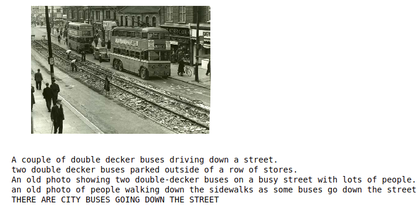
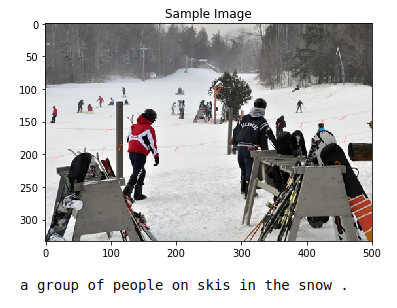
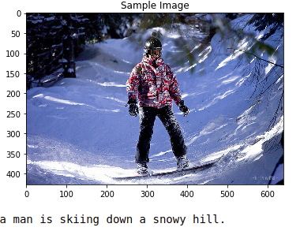
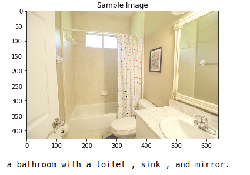
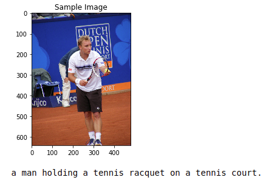

# Project - Facial Keypoint Detection

In this project, I have used the dataset of image-caption pairs to train a CNN-RNN model to automatically generate images from captions

### 1) The Dataset

The Microsoft Common Objects in COntext (MS COCO) dataset is a large-scale dataset for scene understanding. The dataset is commonly used to train and benchmark object detection, segmentation, and captioning algorithms.

More about the [dataset](http://cocodataset.org/#home).

Example Image:

### 2) The Neural Network
The Network is a combination of Enocder and Decoder.

The encoder uses the pre-trained ResNet-50 architecture (with the final fully-connected layer removed) to extract features from a batch of pre-processed images. The output is then flattened to a vector, before being passed through a Linear layer to transform the feature vector to have the same size as the word embedding.

The decoder architecture is based on this [paper](https://arxiv.org/pdf/1411.4555.pdf)

The Complete Architechture :

### 3) Traning the Network

#### Question: How did you select the trainable parameters of your architecture? Why do you think this is a good choice?

Answer: I went with the same : list(decoder.parameters()) + list(encoder.embed.parameters())

Encoder was Resnet50 which was already trained (Transfer Learning).But the last layer of the Encoder needed to be trained, so that it's output makes sense to the following RNN Decoder.

Decoder was completely new ,So had to train all the layers.

### Question: How did you select the optimizer used to train your model?

Answer: I chose ADAM Optimizer with a learning rate of 0.001

1) Since it combines both RMS Prop and Momentum.

2) I had used the same in the Previous CNN Project ( Facial Keypoints ) and It provided good results and the training seemed fast enough.

So decided to go for the same with the same learning rate.

### 4) Results

The trained network was then tested on unseen images and here are the results :

 

 

